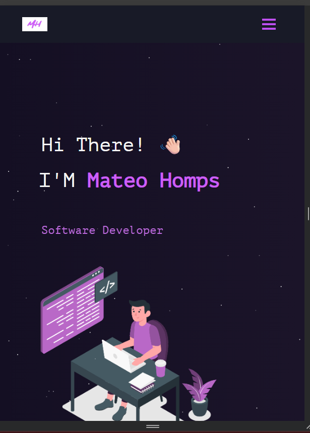

<h2 align="center">
  Mateo Homps — Web Developer Portfolio 
</h2>

  

 
Welcome to my personal portfolio.
This project showcases my work, skills, and journey as a junior web developer. 
Here you’ll find selected projects, information about my background, and the technologies I enjoy working with.
 

This project was built using these technologies.

- React.js
- Node.js
- Express.js
- CSS3
- VsCode

## Features

**📖 Multi-Page Layout**

**🎨 Styled with React-Bootstrap and Css with easy to customize colors**

**📱 Fully Responsive**

